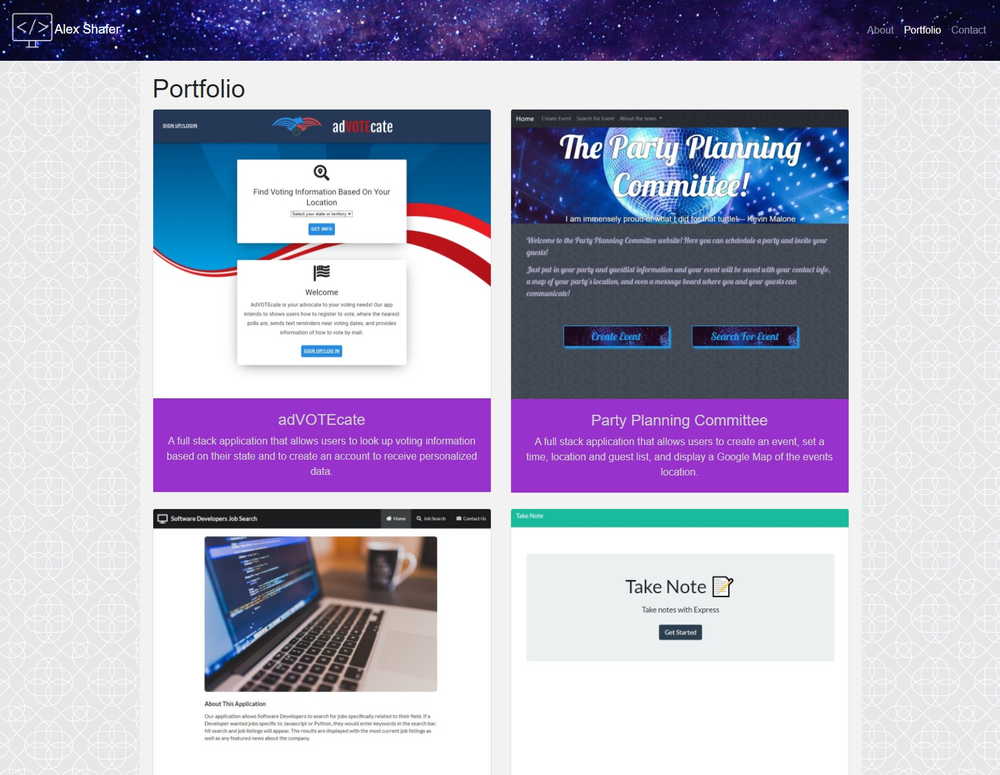

#  responsive-portfolio-two-coding-boogaloo

## Description

An updated version of my portfolio with links to my github, linkedin, resume, and delpoyed projects"

## Demo

## Deployement

https://alexshafer.github.io/responsive-portfolio-two-coding-boogaloo/portfolio.html

## Table of Contents

* [Installation](#installation)

* [Usage](#usage)

* [Credits](#credits)

* [License](#license)

## Installation

npm i

## Usage

There are no special requirements for using this repo

## Credits

Alex Shafer

## License

MIT

## Tests

no test currently implimented

## Questions
